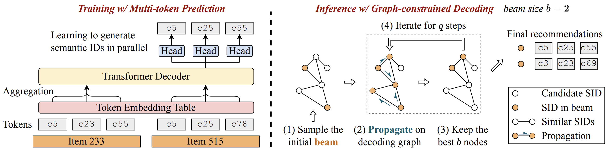

# RPG

This repository provides the code for implementing RPG described in our KDD'25 paper "[Generating Long Semantic IDs in Parallel for Recommendation](https://arxiv.org/abs/2506.05781)".

Semantic ID-based recommendation models tokenize each item into multiple discrete tokens, improving performance, scalability, and memory efficiency. While recent generative models adopt this approach, they suffer from inefficient inference due to resource-intensive beam search and sequential decoding, limiting semantic ID length (typically to 4). We propose RPG, a lightweight framework that produces unordered long semantic IDs, allowing parallel prediction of all tokens. This enables scaling up to 64 tokens per item with strong performance and efficiency.

<div align="center">

</div>

## Quick Start

Run the following command to start training the model with a specified category:

```
CUDA_VISIBLE_DEVICES=0 python main.py --category=Sports_and_Outdoors
```

Available categories:
* `Sports_and_Outdoors`
* `Beauty`
* `Toys_and_Games`
* `CDs_and_Vinyl`

Note that:
1. The datasets will be automatically downloaded once the `category` argument is specified.
2. All hyperparameters can be specified via command line arguments. Please refer to:
    * `genrec/default.yaml`
    * `genrec/datasets/AmazonReviews2014/config.yaml`
    * `genrec/models/RPG/config.yaml`

## Reproduction

### Sports and Outdoors

```
CUDA_VISIBLE_DEVICES=0 python main.py \
    --category=Sports_and_Outdoors \
    --lr=0.003 \
    --temperature=0.03 \
    --n_codebook=16 \
    --num_beams=100 \
    --n_edges=30 \
    --propagation_steps=5
```

### Beauty

```
CUDA_VISIBLE_DEVICES=0 python main.py \
    --category=Beauty \
    --lr=0.01 \
    --temperature=0.03 \
    --n_codebook=32 \
    --num_beams=20 \
    --n_edges=200 \
    --propagation_steps=3
```

### Toys and Games

```
CUDA_VISIBLE_DEVICES=0 python main.py \
    --category=Toys_and_Games \
    --lr=0.003 \
    --temperature=0.03 \
    --n_codebook=16 \
    --num_beams=200 \
    --n_edges=20 \
    --propagation_steps=3
```

### CDs and Vinyl

```
CUDA_VISIBLE_DEVICES=0 python main.py \
    --category=CDs_and_Vinyl \
    --lr=0.001 \
    --temperature=0.03 \
    --n_codebook=64 \
    --num_beams=20 \
    --n_edges=500 \
    --propagation_steps=5
```

## Citing this work

Please cite the following paper if you find our code helpful.

```bibtex
@inproceedings{hou2025rpg,
  title={Generating Long Semantic IDs in Parallel for Recommendation},
  author={Yupeng Hou and Jiacheng Li and Ashley Shin and Jinsung Jeon and Abhishek Santhanam and Wei Shao and Kaveh Hassani and Ning Yao and Julian McAuley},
  booktitle={{KDD}},
  year={2025}
}
```

## Contact

Feel free to open an issue or email me at [yphou@ucsd.edu](mailto:yphou@ucsd.edu).

## License
RPG is CC-BY-NC 4.0 licensed, as found in the LICENSE file.
